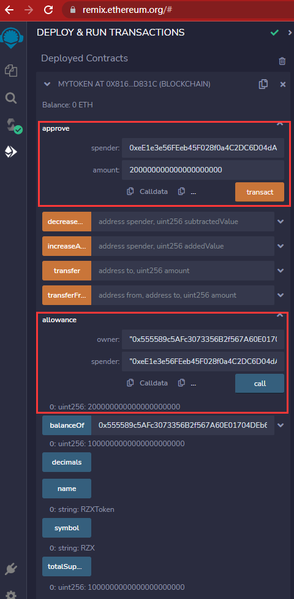

# 结业赛题

##  作业1（20%）:uniswapv2 的liquidity pair是如何保证自己的reserve 和pool的token balance 保持同步的？如何避免overflow的问题？


##  作业2（80%）:
在本地deploy 一个uniswap v2并和它交互，（写在test script 里面）：  
a.在deployed uniswap上创建一个或多个liquidity pair  
b.查看[https://github.com/Uniswap/v2-periphery](https://github.com/Uniswap/v2-periphery), 写多个交互场景的case 和router contract交互  
	i.swap
	ii.add/remove liquidity
	iii.（可选）flashswap
	1.[官方教程](https://wj.qq.com/s2/9563875/c686)：[https://docs.uniswap.org/contracts/v2/guides/smart-contract-integration/using-flash-swaps](https://docs.uniswap.org/contracts/v2/guides/smart-contract-integration/using-flash-swaps)  
	2.[另一个flashswap教程](https://wj.qq.com/s2/9563875/c686)：[https://solidity-by-example.org/defi/uniswap-v2-flash-swap/](https://solidity-by-example.org/defi/uniswap-v2-flash-swap/)


### 2.1 在deployed uniswap上创建一个或多个liquidity pair

```js
const { expect } = require("chai");
const { ethers } = require("hardhat");

describe("UniswapV2Router02.sol", () => {
    let contractFactory;
    let contract;
    let owner;
    let ownerAddress;

    beforeEach(async () => {
        [owner, alice, bob] = await ethers.getSigners();
        ownerAddress = await owner.getAddress();

        contractFactory = await ethers.getContractFactory("UniswapV2Router02");
        contract = await contractFactory.deploy(ownerAddress);
        console.log(`UniswapV2Factory contract address --> ${contract.address}`);
    });

    describe("Test Create Pairs", () => {
        it("createPair", async () => {
            const pairAddr1 = await contract.createPair("0x5B38Da6a701c568545dCfcB03FcB875f56beddC4", "0xAb8483F64d9C6d1EcF9b849Ae677dD3315835cb2");
            console.log(`pair address1 => ${pairAddr1.address}`);

            const pairAddr2 = await contract.createPair("0x4B20993Bc481177ec7E8f571ceCaE8A9e22C02db", "0x78731D3Ca6b7E34aC0F824c42a7cC18A495cabaB");
            console.log(`pair address2 => ${pairAddr2.address}`);

            const pairAddr3 = await contract.createPair("0x5B38Da6a701c568545dCfcB03FcB875f56beddC4", "0x78731D3Ca6b7E34aC0F824c42a7cC18A495cabaB");
            console.log(`pair address3 => ${pairAddr3.address}`);

            const len = await contract.allPairsLength();
            console.log(`all pairs length=> ${len}`);

            expect(len).to.equal(3);
        });
    });
});
```


### 2.2 WETH9合约部署及验证

```bash
#部署WETH9合约
$ npx hardhat run scripts/deploy.js --network goerli
Address deploying the contract --> 0x99998a582E97c3DfADdEAe7e4b197e21699991D3
Token contract address --> 0x9B7EE10171a1A2705a94dc21f0AFFA3782C85355

#验证WETH9合约
$ npx hardhat verify --network goerli 0x9B7EE10171a1A2705a94dc21f0AFFA3782C85355
Successfully submitted source code for contract
contracts/WETH9.sol:WETH9 at 0x9B7EE10171a1A2705a94dc21f0AFFA3782C85355
for verification on the block explorer. Waiting for verification result...

Successfully verified contract WETH9 on Etherscan.
https://goerli.etherscan.io/address/0x9B7EE10171a1A2705a94dc21f0AFFA3782C85355#code
```

### 2.3 Uniswap V2 Factory合约部署及验证

```bash
#部署UniswapV2Factory合约
ubuntu@VM-16-7-ubuntu:~/hardhat-uniswap-v2-factory$ npx hardhat run scripts/deploy.js --network goerli
Downloading compiler 0.5.16
Compiled 12 Solidity files successfully
Address deploying the contract --> 0x22223392B23F28AF9704fF790b185ddc360f0f22
UniswapV2Factory contract address --> 0xec5AAc2Fce22a89064af0A58a7480de4D7Dc3241

#验证UniswapV2Factory合约
https://goerli.etherscan.io/address/0xec5AAc2Fce22a89064af0A58a7480de4D7Dc3241#code
```

### 2.4 Uniswap V2 Router合约部署及验证

```bash
#部署UniswapV2Router02合约
ubuntu@VM-16-7-ubuntu:~/hardhat-uniswap-v2-router$ npx hardhat run scripts/deploy.js --network goerli
Downloading compiler 0.6.6
Compiled 31 Solidity files successfully
Address deploying the contract --> 0x33331d191AfE1889DF85b90F9D4656aE2e7a9833
UniswapV2Router02 contract address --> 0xeE1e3e56FEeb45F028f0a4C2DC6D04dAE0b7d74d

#验证UniswapV2Router02合约
https://goerli.etherscan.io/address/0xeE1e3e56FEeb45F028f0a4C2DC6D04dAE0b7d74d#code
```

### 2.5 ERC20代币合约部署及验证

在`Goerli`网络，发行代币`RZX`和`JS`，发行总量均为1000eth

- **RZX代币**

```bash
#部署RZX代币合约
ubuntu@VM-16-7-ubuntu:~/hardhat-openzeppelin-erc20$ npx hardhat run scripts/deployRZXToken.js --network goerli
Compiled 1 Solidity file successfully
Address deploying the contract --> 0x555589c5AFc3073356B2f567A60E01704DEb6355
Token contract address --> 0x8162a96F3A35586d15Ab81A66937b292642D831c

#验证RZX代币合约
ubuntu@VM-16-7-ubuntu:~/hardhat-openzeppelin-erc20$ npx hardhat verify --contract contracts/OPZERC20.sol:MyToken --network goerli 0x8162a96F3A35586d15Ab81A66937b292642D831c RZXToken RZX 1000000000000000000000
Successfully submitted source code for contract
contracts/OPZERC20.sol:MyToken at 0x8162a96F3A35586d15Ab81A66937b292642D831c
for verification on the block explorer. Waiting for verification result...
Successfully verified contract MyToken on Etherscan.
https://goerli.etherscan.io/address/0x8162a96F3A35586d15Ab81A66937b292642D831c#code
```

- **JS代币**

```bash
#部署JS代币合约
ubuntu@VM-16-7-ubuntu:~/hardhat-openzeppelin-erc20$ npx hardhat run scripts/deployJSToken.js --network goerli
Address deploying the contract --> 0x66666D2d9Ec0eE27bD04D6157D2a92F3f04B1866
Token contract address --> 0x0E7a48B5Da7E8AAce63aBEDCdC1400FF6aF66796

#验证JS代币合约
https://goerli.etherscan.io/address/0x0E7a48B5Da7E8AAce63aBEDCdC1400FF6aF66796#code
```

### 2.6 使用Remix添加RZX代币和JS代币流动性及Swap

#### （1）授权Router合约可以使用200 RZX




#### （2）授权Router合约可以使用200 JS


#### （3）添加流动性

100 RZX - 100 JS

https://goerli.etherscan.io/tx/0xb19ffbe438353afbb320e8f2777d3790edc21d10532bef0391c50dfe0c0d76a5


#### （4）Swap

https://goerli.etherscan.io/tx/0xdd0f57f99b8e681384f3a6d94b309b35dfad3865f13ea167ac7df11c4a76193e


### 2.7 使用ethers添加RZX代币和JS代币流动性及Swap

#### （1）添加流动性

```js
import { ethers } from "ethers";

const ALCHEMY_GOERLI_URL = "https://eth-goerli.alchemyapi.io/v2/xxx";
const provider = new ethers.providers.JsonRpcProvider(ALCHEMY_GOERLI_URL);

const privateKey = "xxx"
const wallet = new ethers.Wallet(privateKey, provider)

const RZXTokenAddress = "0x8162a96F3A35586d15Ab81A66937b292642D831c"
const JSTokenAddress = "0x0E7a48B5Da7E8AAce63aBEDCdC1400FF6aF66796"
const ToAddress = "0x555589c5AFc3073356B2f567A60E01704DEb6355"
const amountADesired = ethers.utils.parseEther("10")
const amountBDesired = ethers.utils.parseEther("10")
const amountAMin = ethers.utils.parseEther("1")
const amountBMin = ethers.utils.parseEther("1")
const deadline = 1671376311

// Uniswap Router的ABI
const abiRouter = [
    "function addLiquidity(address tokenA, address tokenB, uint amountADesired, uint amountBDesired, uint amountAMin, uint amountBMin, address to, uint deadline) external returns (uint amountA, uint amountB, uint liquidity)",
    "function swapExactTokensForTokens(uint amountIn, uint amountOutMin, address[] calldata path, address to, uint deadline) external returns (uint[] memory amounts)"
];

// Uniswap Router合约地址（Goerli测试网）
const addressRouter = '0xeE1e3e56FEeb45F028f0a4C2DC6D04dAE0b7d74d'

const contractRouter = new ethers.Contract(addressRouter, abiRouter, wallet)

const main = async () => {
    const address = await wallet.getAddress();
    console.log(address);

    const tx = await contractRouter.addLiquidity(RZXTokenAddress, JSTokenAddress,
        amountADesired, amountBDesired, amountAMin, amountBMin, ToAddress, deadline)
    await tx.wait()
    console.log(`交易详情：`)
    console.log(tx)
}

main()

```


https://goerli.etherscan.io/tx/0xb610a74a5bac280b80c40ccad55daae8445c675485ea7e5ebab586e3dbc4e051


#### （2）Swap

```js
import { ethers } from "ethers";

const ALCHEMY_GOERLI_URL = "https://eth-goerli.alchemyapi.io/v2/xxx";
const provider = new ethers.providers.JsonRpcProvider(ALCHEMY_GOERLI_URL);

const privateKey = "xxx"
const wallet = new ethers.Wallet(privateKey, provider)

const RZXTokenAddress = "0x8162a96F3A35586d15Ab81A66937b292642D831c"
const JSTokenAddress = "0x0E7a48B5Da7E8AAce63aBEDCdC1400FF6aF66796"
const amountIn = ethers.utils.parseEther("10")
const amountOutMin = ethers.utils.parseEther("1")
// RZX token -> JS token
const paths = [RZXTokenAddress, JSTokenAddress]
const ToAddress = "0x555589c5AFc3073356B2f567A60E01704DEb6355"
const deadline = 1671376311

// Uniswap Router的ABI
const abiRouter = [
    "function addLiquidity(address tokenA, address tokenB, uint amountADesired, uint amountBDesired, uint amountAMin, uint amountBMin, address to, uint deadline) external returns (uint amountA, uint amountB, uint liquidity)",
    "function swapExactTokensForTokens(uint amountIn, uint amountOutMin, address[] calldata path, address to, uint deadline) external returns (uint[] memory amounts)"
];

// Uniswap Router合约地址（Goerli测试网）
const addressRouter = '0xeE1e3e56FEeb45F028f0a4C2DC6D04dAE0b7d74d'

// 声明可写合约
const contractRouter = new ethers.Contract(addressRouter, abiRouter, wallet)

const abiERC20 = [
    "function symbol() view returns (string)",
    "function balanceOf(address) view returns (uint)",
];
const contractRZXToken = new ethers.Contract(RZXTokenAddress, abiERC20, provider)
const contractJSToken = new ethers.Contract(JSTokenAddress, abiERC20, provider)

const main = async () => {
    const address = await wallet.getAddress();
    console.log(address);

    var balanceRZXToken = await contractRZXToken.balanceOf(address);
    var balanceJSToken = await contractJSToken.balanceOf(address);
    console.log("======== Swap前 ========")
    console.log(`RZXToken持仓: ${ethers.utils.formatEther(balanceRZXToken)}`)
    console.log(`JSToken持仓: ${ethers.utils.formatEther(balanceJSToken)}`)

    const tx = await contractRouter.swapExactTokensForTokens(amountIn, amountOutMin, paths, ToAddress, deadline)
    await tx.wait()
    console.log(`交易详情：`)
    console.log(tx)

    balanceRZXToken = await contractRZXToken.balanceOf(address);
    balanceJSToken = await contractJSToken.balanceOf(address);
    console.log("======== Swap后 ========")
    console.log(`RZXToken持仓: ${ethers.utils.formatEther(balanceRZXToken)}`)
    console.log(`JSToken持仓: ${ethers.utils.formatEther(balanceJSToken)}`)
}

main()

```


https://goerli.etherscan.io/tx/0xe646b7e21bdbe176f0b428fbc7d38f4728b4f2b6c2e671caf5f0b16710fc83e5


##  作业3(bonus：40%) :

查看
[https://hardhat.org/hardhat-network/docs/guides/forking-other-networks](https://hardhat.org/hardhat-network/docs/guides/forking-other-networks)的教程，利用mainnet forking， 和主网的protocol进行交互和测试（写在test script 里面）  
a.和主网的uniswap 进行交互测试  
i.swap  
ii.add/remove liquidity  
iii.flashswap  
1.[官方教程](https://wj.qq.com/s2/9563875/c686):[https://docs.uniswap.org/contracts/v2/guides/smart-contract-integration/using-flash-swaps](https://docs.uniswap.org/contracts/v2/guides/smart-contract-integration/using-flash-swaps)  
2.[另一个flashswap教程](https://wj.qq.com/s2/9563875/c686):[https://solidity-by-example.org/defi/uniswap-v2-flash-swap/](https://solidity-by-example.org/defi/uniswap-v2-flash-swap/)  
b.尝试和主网的其他protocol进行交互测试，例如一些lending protocol：compound


#### 3.1 修改hardhat.config.js，fork主网


